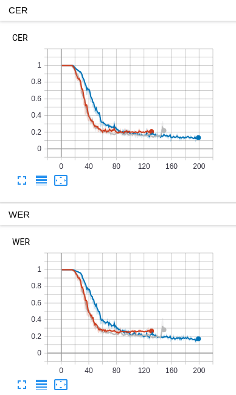

RNNT-pytorch  
---
Implementation of RNN-Transducer 

Installation
---
0. pip isntall -r requirments.txt
1. Install torch  
2. Install rnnt loss 
3. install torch audio
 
[rnnt loss hawk aron's implementation](https://github.com/HawkAaron/warp-transducer/tree/master/pytorch_binding)  
```
## ref hawk aron's read me
git clone https://github.com/HawkAaron/warp-transducer
cd warp-transducer
mkdir build; cd build
cmake ..
make

cd pytorch_binding
python setup.py install
```  

Train Decoder (optional)
---
```
python train_decoder_LM.py --train-manifest ./data/LM/train_LM.txt
```

Train Network
---

```
python train.py --val-manifest {your val manifest csv path} --train-manifest {your train manifest csv path
```

Results
---
Data|Parameter Setting|WER|CER
----|---|---|---
an4|3encoder, 2decoder, 250 hidden size, 0.2 drop out|25.06|19.2
an4|+augmentation + batch normalization|18.11|13.72
an4|+specAugment|12.14|10.4



Things To Do
---
1. 입력으로 사용하는 특징들을  spectrogram, filter bank, word piece 종류 늘리기.
2. 네트워크 구조 다듬기.
3. LM 선학습 후 사용 가능하게 하기.
    
References
---
1. [EXPLORING RNN-TRANSDUCER FOR CHINESE SPEECH RECOGNITION](https://arxiv.org/pdf/1811.05097.pdf)
2. [speech, RNNT Loss by awni](https://github.com/awni/speech)
3. [E2E-ASR by hawk aron](https://github.com/HawkAaron/E2E-ASR)
4. [EXPLORING ARCHITECTURES, DATA AND UNITS FOR STREAMING END-TO-END SPEECH RECOGNITION WITH RNN-TRANSDUCER](https://arxiv.org/pdf/1801.00841.pdf)
5. [A Comparison of Sequence-to-Sequence Models for Speech Recognition](https://www.isca-speech.org/archive/Interspeech_2017/pdfs/0233.PDF)